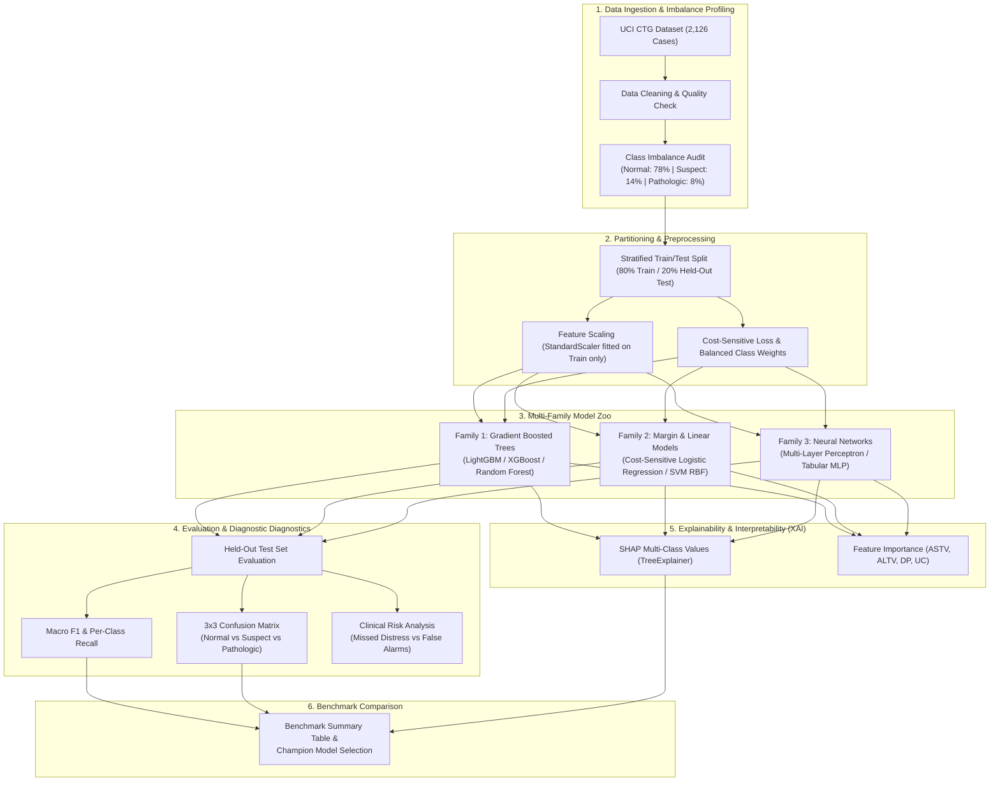

# Fetal Distress Detection from Cardiotocography (CTG) Signals

[](https://www.python.org/)
[](https://opensource.org/licenses/MIT)

An end-to-end clinical machine learning framework for detecting fetal distress from Cardiotocography (CTG) recordings. The system evaluates multiple distinct model families across a stratified held-out split, implements cost-sensitive class weighting for severe class imbalance, generates $3 \times 3$ confusion matrices, reports macro-averaged F1 metrics, and provides explainability via SHAP (SHapley Additive exPlanations).

---

## 📌 Problem Statement & Clinical Context

During labor and delivery, electronic fetal monitoring via Cardiotocography (CTG) tracks two continuous physiological signals:
1. **Fetal Heart Rate (FHR):** Baseline rhythm, accelerations, decelerations, and short/long-term variability.
2. **Uterine Contractions (UC):** Frequency, duration, and intensity of maternal uterine activity.

### The 3-Class Triage Target:
* **Class 1 (Normal):** Physiological baseline with normal variability and presence of accelerations. No intervention required.
* **Class 2 (Suspect):** Borderline features requiring active observation or conservative intrauterine resuscitation.
* **Class 3 (Pathological):** Severe decelerations (prolonged/variable/late) or absent variability indicating fetal hypoxia/acidosis. Requires immediate obstetric intervention (e.g., emergent Caesarean section).

### The Imbalance & Clinical Cost Asymmetry:
* **The Imbalance:** The real-world distribution is heavily skewed toward Normal cases (~78% Normal, ~14% Suspect, ~8% Pathological).
* **Asymmetric Error Costs:**
  - **False Negative (Missed Distress):** Catastrophic clinical outcome (neonatal encephalopathy, cerebral palsy, or stillbirth).
  - **False Positive (False Alarm):** Unnecessary emergency surgical intervention, maternal trauma, and hospital resource burden.
  - **Evaluation Requirement:** **Macro F1 Score** and per-class recall (Accuracy alone is clinically misleading).

---

## 📊 Dataset Landscape

The workspace includes structured access to the primary clinical benchmark datasets:

```
datasets/
├── uci_ctg/
│   ├── CTG.xls               # Original canonical UCI multi-sheet database
│   └── CTG_cleaned.csv       # 2,126 recordings, 21 CTG features, 3-class target
└── physionet_ctu_uhb/
    ├── RECORDS.txt           # Directory of all 552 PhysioNet intrapartum deliveries
    ├── 1001.hea & 1001.dat   # Continuous 4 Hz FHR + UC signal (pH=7.14, Apgar=6/8)
    ├── 1002.hea & 1002.dat   # Sample continuous 4 Hz recording
    └── 1003.hea & 1003.dat   # Sample continuous 4 Hz recording
```

### The 21 Clinical Morphological Features
| Group | Feature Code | Clinical Description |
| :--- | :--- | :--- |
| **Baseline & Activity** | `LB` | FHR baseline (beats per minute) |
| | `AC` | Number of accelerations per second |
| | `FM` | Number of fetal movements per second |
| | `UC` | Number of uterine contractions per second |
| **Decelerations** | `DL` | Light decelerations per second |
| | `DS` | Severe decelerations per second |
| | `DP` | Prolonged decelerations per second |
| **Variability** | `ASTV` | Percentage of time with abnormal short term variability |
| | `MSTV` | Mean value of short term variability |
| | `ALTV` | Percentage of time with abnormal long term variability |
| | `MLTV` | Mean value of long term variability |
| **Histogram Morphometrics** | `Width` | Histogram width (Max - Min) |
| | `Min` / `Max` | Minimum / Maximum FHR frequencies |
| | `Nmax` / `Nzeros` | Number of histogram peaks / Number of histogram zeros |
| | `Mode` / `Mean` / `Median` | Statistical central tendencies of FHR |
| | `Variance` | Histogram variance |
| | `Tendency` | Histogram asymmetry (-1: left, 0: symmetric, 1: right) |

---

## 🏗️ End-to-End Pipeline Architecture



---

## 🔬 Model Families & Mathematical Principles

1. **Family 1: Gradient Boosted Decision Trees (LightGBM & Random Forest)**
   - *Inductive Principle:* Orthogonal recursive splitting of non-linear feature interactions (e.g. $ASTV > 65\% \land DP > 0$).
   - *Imbalance Strategy:* Balanced sub-sampling and class-weighted gradients.
2. **Family 2: Regularized Margin & Linear Classifiers (SVM RBF & Logistic Regression)**
   - *Inductive Principle:* Maximum-margin geometric separation in kernelized Hilbert space / regularized log-odds hyperplanes.
   - *Imbalance Strategy:* Cost-sensitive penalty parameter $C_k \propto 1 / N_k$.
3. **Family 3: Deep Neural Networks (Multi-Layer Perceptron - Tabular MLP)**
   - *Inductive Principle:* Layered continuous affine transformations with ReLU activations and dropout regularizers.

---

## 🚀 Quickstart & Reproduction

### 1. Install Dependencies
```bash
pip install -r requirements.txt
```

### 2. Fetch Datasets
```bash
python fetch_all_datasets.py
```

### 3. Preprocess & Validate Data
```bash
python preprocess.py
```

### 4. Train Models, Evaluate Held-out Split & Generate SHAP Analysis
```bash
python train_models.py
```

All evaluation metrics, benchmark comparison tables, $3 \times 3$ confusion matrix plots, and SHAP interpretability charts will be exported to the `outputs/` folder.
